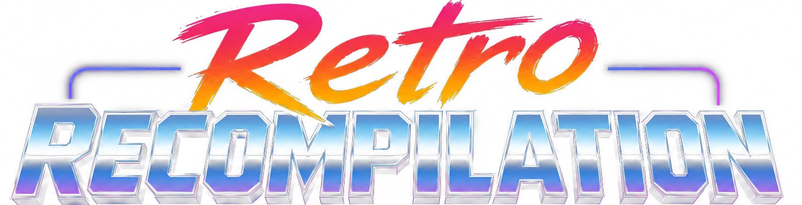
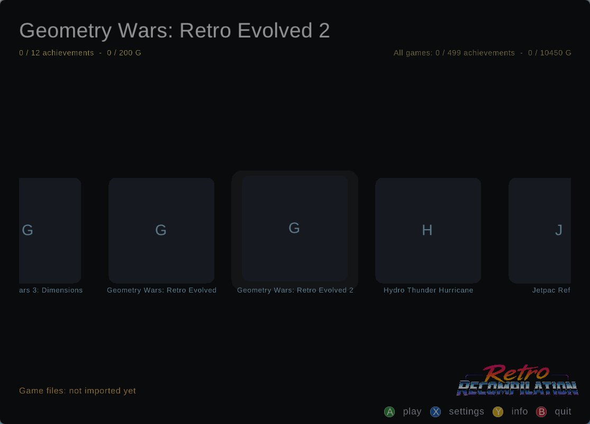

# Xbox 360 Native Ports

Xbox 360 titles recompiled to run natively. Each release on this page is a
**launcher**: the recompiled game code, a native Vulkan renderer, a native
audio path and a small GUI. It contains no game data. You point it at your own
copy of the game - an archive, a disc image (`.iso`) or an extracted folder -
and it imports that, verifies it against the checksums the port was built
from, and plays.

Every title has a Linux launcher and a Windows launcher; see each release's
notes for what has been tested. No Android builds of these disc titles yet:
they are too slow until the console layer is fully native.

## The launcher: rexmenu

Every title boots into **rexmenu**, the same raylib front-end
(`_menu/src/main.cpp`). It shows the whole collection on a game rail, tracks
achievements per title and across the library, manages saves, imports new
games - and then runs the game *inside its own window*: the title executes in
a headless gamescope session and streams its frames into the menu, so there is
no window switching and no focus fighting. Input goes to the game through a
virtual Xbox 360 pad.

*Home rail on a fresh install: letter tiles and "not imported yet" until you
point the launcher at your own copy of each game. Once a title's content is
imported, its dashboard tile art appears.*

### Controls

| pad | keyboard | what it does |
|---|---|---|
| left stick / d-pad | W/A/S/D or arrows | move around the rail, lists and file browser |
| A | Space | play / confirm |
| B | Tab | back / quit |
| X | X | settings (FPS cap, pad options) |
| Y | Y | info page (overview, achievements, game files / DLC, saves) |
| Start | Return | in-game Start |
| RB | E | in-game bumpers (accelerate in racers) |
| LB | Q | in-game bumpers (brake in racers) |

### Importing a game - accepted file types

Press play on a title with no content and the launcher opens its file browser.
Point it at your own copy of the game in any of these forms:

| what you have | file type(s) | how the launcher handles it |
|---|---|---|
| Disc image | `.iso` (XDVDFS) | read directly by `rexiso` from the SDK |
| Archive of the disc/XBLA files | `.rar`, `.zip`, `.7z` | extracted with `unrar` / `unzip` / `7z` |
| XBLA/GoD package | STFS / LIVE / PIRS / CON (`.pirs`, `.con`, `.live`, `.ztm`, `.cab`, or extensionless) | unpacked by `stfs_extract.py` |
| Bare executable | `.xex` (XEX2 header checked) | copied to `assets/default.xex` |
| Already-extracted folder | a directory | whole tree copied into `assets/` |
| DLC package | LIVE / PIRS / CON (content type 2) | title ID is checked against the imported game, then installed into the shared profile content folder |

After import the whole asset tree is sha256-verified against the checksums
the port was built from (`content/content.sha256`); a verified marker means
later launches skip re-hashing. Games without imported content stay dimmed on
the rail with a "NO ASSETS" badge.

### Playing and settings

- **Play** launches the game embedded in the menu window, with an on-screen
  FPS counter fed by the game's real present rate.
- **Settings** cycles the frame-rate cap: 30 / 60 / 120 / 240 / Off ("Max" -
  vblank waits are disabled and the title free-runs; some games over-speed,
  since they pace logic on presents). Settings are stored per title.
- **Info (Y)** shows the overview, the achievement list (read from the same
  unlock file the in-game overlay uses), imported game files and DLC, and the
  save manager, which can back up or delete saves (deletes always back up
  first).
- If a game exits abnormally the launcher shows its log tail instead of
  dropping you back silently.

## Using a release launcher

### Linux

1. Download the title's `*-launcher-linux-x86_64.tar.zst` from
   [Releases](../../releases) and unpack it:
   `tar --zstd -xf burnoutrevenge-launcher-linux-x86_64.tar.zst`
2. Run `./run.sh`. rexmenu opens on the game rail; press play on the title
   and its file browser asks where your copy of the game is - a
   `.rar`/`.zip`/`.7z`, a `.iso` disc image, an STFS/LIVE/PIRS package or the
   extracted folder (see the full file-type table above). Each launcher names
   the disc (region and title ID) its checksums came from - the same disc
   gives a byte-for-byte verified import; another region usually runs but will
   not match the checksums.
3. Play. Saves and settings stay in `user-data/` next to the launcher.

Needs: Linux x86-64, a Vulkan-capable GPU driver, `gamescope`,
`7z` or `unrar` if your copy is an archive, `python3`.

### Windows

1. Download `*-launcher-windows-x86_64.zip` and unzip it.
2. Run `Launcher.bat` (Import game files / Play / Close) or `Play.bat`, which
   imports on first run. The importer takes a `.zip`, a `.iso` (read by the
   bundled `rexiso.exe`), an extracted folder, or a `.7z`/`.rar` if 7-Zip is
   installed.
3. Play. Saves and settings stay in `user-data\`.

Needs: Windows 10/11 x64 with a Vulkan GPU driver. The Windows builds are
cross-compiled from the same sources; the release notes say how far each has
been tested.

Both end up in the rexmenu UI described above, with the controls from the
table. A game controller works as expected.

## What is native and what is not

The launcher page shows it per title, but the layers are the same for all:

| layer | what runs |
|---|---|
| CPU | the game's PowerPC code, recompiled ahead of time to native x86-64 - no interpreter, no JIT |
| Graphics | a native Vulkan renderer; the console's command stream and shaders run as Vulkan |
| Audio | a native mixer; XMA effects and WMA soundtracks are decoded natively |
| Console OS calls | the one layer still moving: each port answers a growing share of the console's kernel calls itself, the rest go through the runtime's console layer - the percentage in the titles table below is measured from the console calls each game actually makes. CPU, graphics and audio are native on every title; the native / ReXGlue split is only this console-OS-call layer |

## Titles

| title | type | console calls native | via ReXGlue |
|---|---|---|---|
| Burnout Revenge (USA) | Disc | 24% | 76% |
| Ridge Racer Unbounded (USA) | Disc | 0% | 100% |
| Midnight Club: Los Angeles - Complete Edition (USA) | Disc | 0% | 100% |
| Split/Second (USA) | Disc | 0% | 100% |
| Banjo-Kazooie | XBLA | 0% | 100% |
| Banjo-Tooie | XBLA | 0% | 100% |
| Geometry Wars: Retro Evolved | XBLA | 13% | 87% |
| Geometry Wars: Retro Evolved 2 | XBLA | 0% | 100% |
| Rez HD | XBLA | 0% | 100% |
| SoulCalibur II HD Online | XBLA | 0% | 100% |
| After Burner Climax | XBLA | 0% | 100% |
| Hydro Thunder Hurricane | XBLA | 0% | 100% |
| Space Giraffe | XBLA | 0% | 100% |
| OutRun Online Arcade | XBLA | 0% | 100% |
| Daytona USA | XBLA | 0% | 100% |
| Geometry Wars 3: Dimensions | XBLA | 0% | 100% |

Every title is playable. Each port's `CONVERSION.md` records what was done to
it, and its release page has the launcher downloads.

## Building from source

This repository is the full source drop behind the releases: the launcher
and the port trees. Game data is not here - each port imports your own copy
at first run, exactly like the prebuilt launchers.

| path | what it is |
|---|---|
| `_menu/` | rexmenu, the raylib game launcher every title boots into |
| `_shared/` | shared launch scripts (`embedded_play.sh`), import/validation tooling, the game list (`games.index`) |
| `collections/sega/xbla/`, `collections/sega/dvd/` | one directory per port: hand-written glue (`src/`), generated recompiled code (`generated/`), per-title config (`config/`), import/headless tools (`tools/`), bring-up notes (`CONVERSION.md`) |
| `racing-recomps-launcher/` | standalone launcher for the racing titles |
| `_testing/` | import-path test fixtures and harness (synthetic, no game data) |
| `docs/` | [what the launcher offers](docs/LAUNCHER.md) and [what our rexglue fork changes vs upstream](docs/REXGLUE_FORK_CHANGES.md) |

The runtime SDK (our fork of [rexglue-sdk](https://github.com/rexglue/rexglue-sdk))
is **not** in this repository — it lives in a separate private repo and is
fetched at build time. [docs/REXGLUE_FORK_CHANGES.md](docs/REXGLUE_FORK_CHANGES.md)
summarizes what the fork changes vs upstream.

Note: this is a working source drop, not a relocatable build tree. Some
scripts still carry absolute paths from the development checkout
(`/home/jon/recomp-ports/recomp-family`, `/home/jon/rexglue-vmx`) — adjust
those (or symlink) when building from a fresh clone.

## Legal

No game files, discs, packages or assets are distributed here or downloaded by
the launchers. `content/content.sha256` holds only checksums, so an import can
be verified. You need to own the game.

The runtime is built on [rexglue-sdk](https://github.com/CrownParkComputing/rexglue-sdk)
(portions derived from the Xenia project).
